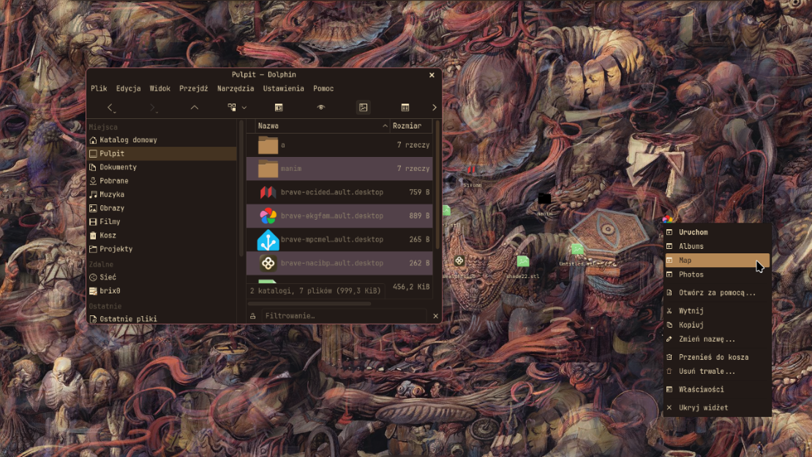

# driftwm-desktop

Modular, native desktop icons designed specifically for the **[DriftWM](https://github.com/malbiruk/driftwm)** infinite canvas Wayland compositor.

Each desktop icon is an independent, frameless, transparent widget living directly on the infinite canvas. Icons pan and zoom alongside the canvas, stay organized below regular windows, and can be interactively repositioned anywhere in 2D space.

---

## Screenshot



---

## Features

- **Infinite Canvas Native**: Each desktop launcher is a dedicated Wayland surface configured with DriftWM's `widget = true` window rule:
  - Renders below application windows and stays off Alt-Tab.
  - Smoothly pans and scales with the viewport camera and zoom level.
- **Interactive 1:1 Mouse Drag & Drop**:
  - Click and drag any desktop icon to move it seamlessly across the canvas via DriftWM IPC.
  - Precise scale-independent tracking: motion perfectly matches cursor speed at all canvas zoom levels.
- **External Application Drag & Drop**:
  - Hold <kbd>Ctrl</kbd> or <kbd>Shift</kbd> while dragging to initiate a native FreeDesktop `QDrag` object with `text/uri-list`.
  - Drop files directly into external programs like Dolphin, Visual Studio Code, web browsers, Discord, or terminals.
- **Live Desktop Monitoring**:
  - Automatically watches the XDG Desktop directory (`~/Desktop` or `~/Pulpit`) via `inotify` (`QFileSystemWatcher`).
  - New files immediately appear in the grid; deleted files close their widgets; modified files update their title and icon live.
- **Full Desktop Actions Support**:
  - Supports FreeDesktop Desktop Entry specifications (`Actions=` and `[Desktop Action <id>]`).
  - Web applications and desktop apps (e.g. Immich *Albums/Map/Photos*, SiYuan *Desktop/Mobile*) render all native actions in their right-click menu.
- **Dolphin-Like Context Menu**:
  - **Launch / Open** (with debounce to prevent accidental duplicate launches)
  - **Open With...** (*Wybór programu* via native XDG Desktop Portal / system app chooser dialog)
  - **Cut** & **Copy** to system clipboard (`x-special/gnome-copied-files` & URI lists)
  - **Rename...** (in-place renaming with instant disk and widget update)
  - **Move to Trash** (FreeDesktop trash specification via `gio trash`)
  - **Delete Permanently**
  - **File Properties** (via `org.freedesktop.FileManager1.ShowItemProperties` or native dialog)
- **Automatic Multi-Process Grid Reset**:
  - Reorganizes desktop icons into a clean 8-column camera-anchored grid using `--reset` or `--reset-positions`.
  - Works dynamically even while another `driftwm-desktop` process is already active.
- **MIME-Type Driven Themed Icons**:
  - Employs FreeDesktop `shared-mime-info` (`QMimeDatabase`) with intelligent candidate fallbacks for generic filetypes (e.g. STL 3D models, PDFs, images, archives).
- **Persistent State & Boot Race Protection**:
  - Tracks live window coordinates into `~/.local/state/driftwm-desktop.json`.
  - Includes initialization guards that prevent initial window manager auto-placements from overwriting saved user coordinates.
- **Internationalization (i18n) — Translations & PRs Welcome!**:
  - Fully dynamic JSON translation catalogs loaded from `driftwm_desktop/locales/`.
  - Ships with English (`en`) and Polish (`pl`), auto-detected from the system locale or specified via `--lang`.
  - Adding new languages requires no code changes — Pull Requests for additional languages are warmly welcome!

---

## DriftWM Window Rule Setup

Add the following rule to your `~/.config/driftwm/config.toml` so the compositor pins desktop launchers to the canvas:

```toml
[[window_rules]]
app_id     = "driftwm.desktop"
widget     = true
decoration = "none"
```

To auto-start `driftwm-desktop` on login, add it to the `autostart` list in your `config.toml`:

```toml
autostart = [
    "driftwm-desktop"
]
```

---

## Installation & Running

### Using Nix / Flakes (Recommended)

Run directly with Nix Flakes:

```bash
nix run github:<your-username>/driftwm-desktop
# or locally from source:
nix run .
```

#### NixOS / Home-Manager Flake Integration

Add `driftwm-desktop` to your `flake.nix` inputs:

```nix
{
  inputs = {
    nixpkgs.url = "github:nixos/nixpkgs/nixos-unstable";
    driftwm-desktop.url = "github:<your-username>/driftwm-desktop";
  };

  outputs = { self, nixpkgs, driftwm-desktop, ... }: {
    # In your home-manager or nixos configuration:
    environment.systemPackages = [
      driftwm-desktop.packages.${pkgs.system}.default
    ];
  };
}
```

### Running with Python Directly

Requirements:
- Python 3.9+
- PyQt5 & QtWayland
- `dbus-python`
- `glib` / `gio` (optional, for trash and properties)
- `driftwm` in `$PATH`

```bash
python3 ./driftwm-desktop
```

---

## CLI Options

```
usage: driftwm-desktop [-h] [--daemon] [--desktop-dir DESKTOP_DIR]
                       [--no-daemon] [--restore-only] [--reset-positions]
                       [--lang {en,pl}]

driftwm-desktop: Modular Desktop Icons for DriftWM

options:
  -h, --help            show this help message and exit
  --daemon              Run only the driftwm subscription daemon to track
                        window coordinates
  --desktop-dir DESKTOP_DIR
                        Custom desktop directory (defaults to XDG Desktop folder)
  --no-daemon           Do not start the background subscribe daemon with the GUI
  --restore-only        Only restore coordinates for already running desktop windows and exit
  --reset-positions, --reset
                        Reset all desktop item positions to a clean default grid
                        and update saved state (safe to run while the app is active)
  --lang LANG           Override language code (e.g. 'en', 'pl', defaults to system locale)
```

---

## Internationalization & Contributing Translations

`driftwm-desktop` uses plain JSON translation catalogs in the `driftwm_desktop/locales/` directory (e.g. `en.json`, `pl.json`). All catalogs are loaded dynamically at runtime.

Pull Requests adding or refining translations for any language are warmly welcome!

### Adding a New Language

1. Copy `driftwm_desktop/locales/en.json` to `driftwm_desktop/locales/<language_code>.json` (for instance, `de.json`, `fr.json`, `es.json`, `uk.json`).
2. Translate the values in the JSON file.
3. Test your translation with `driftwm-desktop --lang <language_code>`.
4. Submit a Pull Request!

---

## Related Links & Documentation

- **[DriftWM Official Repository](https://github.com/malbiruk/driftwm)**
- **[DriftWM IPC Documentation](https://github.com/malbiruk/driftwm/blob/master/docs/ipc.md)**
- **[DriftWM Window Rules Specification](https://github.com/malbiruk/driftwm/blob/master/docs/window-rules.md)**
- **[DriftWM Desktop Icons Discussion #204](https://github.com/malbiruk/driftwm/discussions/204)**

---

## License

MIT
